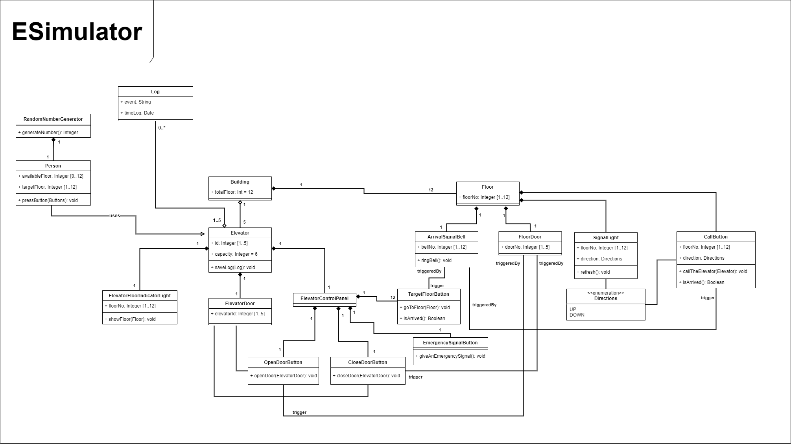

# Patika.dev OOP Homeworks

## University Management System UML

- There are classes, work offices and departments those belong to University.
- There are offices those are belong to departments.
- There are employees those are work in University. Those employees can be officer or professor.
- Every employee works in an office.

## Zoo Management UML

- The most of gathered informations about animals are the same for all of groupings.
- Also, the system should be able to get specific dosage of medicines for animals. => getDosage ()
- The system should be able to calculate to feeding times. => getFeedSchedule ()
- The process fulfilment logic of the system is going to be different for every grouping. (e.g. Feeding algorithm of horses is going to be different from tigers.)

## Airport Management UML

- Airport operate the flights. Every airport has a identity.
- The airport has different types of airplane.
- Airplanes run or they may be in maintenance.
- Each flight has a unique identity, airport to take off and land at, and departure and landing times.
- Every flight has a pilot and co-pilot, and they operate the plane.
- Airports have unique IDs and names.
- Airlines have pilots and each pilot has a level of experience.
- An aircraft type may need a certain number of pilots.

## Online Movie Website

- Movies can be listed and sorted in the application and users can subscribe to the application.
- Users purchase credits through the system for subscription.
- Only subscribed users can rent movies with their credits and the credit amount of the rented movie is deducted from their account.
- Regular users and subscribers can purchase movies
- If the film is not available, it can be requested.

## Elevator Simulation UML

- Kodluyoruz The Insurance Company wants to build a 12-storey office building and equip it with the latest elevator technology. The company wants you to create a software simulator that models the operations of the building's elevators to see if they can meet the traffic flow needs within the building.
- The building will have five elevators, each of which can reach 12 floors of the building. Each elevator has a capacity of approximately six adult passengers. Elevators are designed to be energy efficient, so they only move when needed. Each elevator has its own door, floor indicator light and control panel. The control panel has target buttons, door open and close buttons, and an emergency signal button.
- Each floor in the building has a door for each of the five elevator shafts and an arrival bell for each door. The arrival bell indicates that the elevators have arrived at a floor. A signal light on each door indicates the arrival of the elevator and the direction the elevator is moving. Each floor also has three sets of elevator call buttons.
- A person calls an elevator by pressing the appropriate call button (up or down). A scheduler assigns one of five elevators to go to the floor where the search started. Upon entering the elevator, a passenger typically presses one or more destination buttons. As the elevator moves from floor to floor, an indicator light inside the elevator informs passengers about the location of the elevator. The arrival of an elevator to a floor is indicated by the lighting of the indicator lamp above the outer elevator door and the ringing of the floor bell. When an elevator stops at a floor, both sets of doors open automatically for a predetermined time, allowing passengers to enter and exit the elevator.
- The eSimulator uses a "clock" to simulate real time lapse and timestamp and log events that occur in the simulation. A random number generator is used by the simulator to generate passengers and determine the departure and arrival floors for each passenger.

